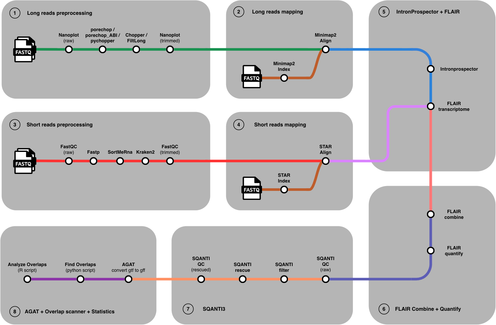

# NATSEQ

A Nextflow (DSL2) pipeline for identification of **natural antisense transcripts (NATs)** from long-read Oxford Nanopore RNA-seq data (dRNA / cDNA / direct-cDNA), with optional short-read (Illumina) support for extra splice-junction evidence.

## What it does, and why

A NAT is a pair of transcripts that sit on **opposite strands** of the genome and overlap in coordinates — one gene's sense transcript facing another gene's (or the same locus's) antisense transcript. They're a known but under-characterized layer of gene regulation, and long-read sequencing is what makes them tractable to detect directly: because a long read typically spans a full transcript, it lets you reconstruct an actual isoform (with a real strand and real exon structure) instead of inferring one from fragmented short reads.

This pipeline takes raw ONT FASTQ (any mix of dRNA / cDNA / direct-cDNA libraries in one run), reconstructs a transcriptome de novo, structurally classifies and cleans up the reconstructed transcripts against a reference annotation, and then scans the result for opposite-strand transcript pairs that overlap in the genome — reporting each candidate NAT pair with the evidence behind it (exon overlap, orientation, reference support, SQANTI3 category, TSS/TES distance, etc.).

## Pipeline overview



Every stage past the input is individually skippable (`--skip_*`, see [Parameters](#parameters)) by supplying its output directly in the samplesheet instead — e.g. pre-aligned BAMs, a pre-built STAR index, or an already-reconstructed FLAIR transcriptome.

## Tools this pipeline wraps

| Stage | Tool | Role |
|---|---|---|
| Long-read QC | [NanoPlot](https://github.com/wdecoster/NanoPlot) | Before/after QC plots |
| Adapter trimming | [Porechop](https://github.com/rrwick/Porechop) / [Porechop_ABI](https://github.com/bonsai-team/Porechop_ABI) / [Pychopper](https://github.com/epi2me-labs/pychopper) | Adapter removal; Pychopper also reorients reads to the correct strand by primer identification (used for cDNA/direct-cDNA — matters for a strand-specific pipeline) |
| Quality filtering | [Chopper](https://github.com/wdecoster/chopper) / [Filtlong](https://github.com/rrwick/Filtlong) / [NanoFilt](https://github.com/wdecoster/nanofilt) | Length/quality filtering |
| Short-read QC/trim | [FastQC](https://www.bioinformatics.babraham.ac.uk/projects/fastqc/), [fastp](https://github.com/OpenGene/fastp) / [Trimmomatic](http://www.usadellab.org/cms/?page=trimmomatic) | Illumina QC and trimming |
| Long-read alignment | [minimap2](https://github.com/lh3/minimap2) | Splice-aware alignment to the reference genome |
| Short-read alignment | [STAR](https://github.com/alexdobin/STAR) | Splice-aware alignment, used for its `SJ.out.tab` splice-junction evidence |
| Junction detection | [IntronProspector](https://github.com/diekhans/intronProspector) | Splice junctions directly from long-read BAMs |
| Transcriptome reconstruction | [FLAIR](https://github.com/BrooksLabUCSC/flair) | De novo isoform reconstruction, per-group combination, quantification |
| Structural classification | [SQANTI3](https://github.com/ConesaLab/SQANTI3) | Classifies reconstructed transcripts against the reference, filters and rescues likely artifacts |
| Annotation normalization | [AGAT](https://github.com/NBISweden/AGAT) | Cleans up the final GTF/GFF |
| NAT detection | `bin/nat_caller.py` (this repo) | Scans the reconstructed, classified transcriptome for opposite-strand overlapping pairs |

## Requirements

- [Nextflow](https://www.nextflow.io/) ≥ 24.04 (developed and tested on 26.04.6)
- [Conda](https://conda.io/)/[Miniforge](https://github.com/conda-forge/miniforge) — every process resolves its own environment from a per-module `environment.yml`; nothing needs to be preinstalled globally beyond conda itself
- A single Linux workstation with a reasonable number of cores and RAM. The bundled resource profile targets **44 CPU / 350 GB** (`executor {}` in `nextflow.config`, set at ~70% of a 64-core/512 GB host) and the `executor` is hardcoded to `local` — there is no cluster/HPC profile (Slurm, AWS Batch, etc.) at this time. Adjust `executor.cpus`/`executor.memory` in `nextflow.config` to match your own machine before running.
- A compiled `intron-prospector` binary on `PATH` (see `bin/`) — bioconda does not currently provide a resolvable package for this tool (verified: its bioconda recipe has an unsatisfiable `htslib`/`libdeflate` dependency conflict), so it has to be built from [source](https://github.com/diekhans/intronProspector) locally rather than pulled from conda.

## Installation

```bash
git clone https://github.com/everythinginthedot/NATSEQ.git
cd NATSEQ

# Nextflow itself
conda install -c bioconda nextflow
# or, without conda: curl -s https://get.nextflow.io | bash

# per-process conda environments are created automatically on first run —
# nothing else to install manually, aside from intron-prospector (see Requirements)
```

Reference files needed before your first run (not included in this repository — see `.gitignore`):
- A **bgzip-compressed** reference genome FASTA (`samtools faidx` requires bgzip, plain gzip will not work)
- A GENCODE-compatible reference GTF annotation

## Running

Minimal example:

```bash
nextflow run main.nf \
    --input samplesheet.csv \
    --genome /path/to/genome.fa.gz \
    --annotation /path/to/annotation.gtf \
    --outdir results/
```

Useful flags for a real run:

```bash
nextflow run main.nf \
    --input samplesheet.csv \
    --genome /path/to/genome.fa.gz \
    --annotation /path/to/annotation.gtf \
    --outdir results/ \
    --skip_short_preprocessing \
    --skip_aligning_star \
    -resume
```

(`--skip_short_preprocessing --skip_aligning_star` is the common case when a samplesheet has no Illumina data at all — every step downstream still runs, just without STAR splice-junction evidence, falling back to IntronProspector's junctions alone.)

`-resume` is strongly recommended for anything beyond a quick test — every stage is chunked and cached per-sample, so a re-run after a crash, a tuning change, or an added sample only recomputes what actually changed.

## Samplesheet format

One CSV, referenced via `--input`, one row per sample:

```
sample_id,group_id,read_type,library_type,replicate,strandedness,fastq_1,fastq_2,bam,bai,star_sj,gtf,bed,fa,map
```

| Column | Required | Meaning |
|---|---|---|
| `sample_id` | always | Unique sample identifier |
| `group_id` | always | Samples sharing a `group_id` get their STAR splice-junction evidence pooled, and would be merged into one transcriptome by `FLAIR combine`/`quantify` if their count is ≥2 for that group. In practice this project gives every sample its own `group_id` (one row = one group) — pooling replicates via `FLAIR combine` isn't used here, since it collapses per-replicate signal and makes it impossible to tell whether a candidate NAT pair actually reproduces across replicates rather than showing up in just one |
| `read_type` | always | `long` or `short` |
| `library_type` | long reads | `dRNA`, `cDNA`, or `direct-cDNA` — drives both the minimap2 alignment preset and which adapter-trimming tool runs (see [Parameters](#parameters)) |
| `replicate` | informational | Biological replicate number, not consumed by any process logic |
| `strandedness` | informational | Carried through but not currently consumed by any process logic |
| `fastq_1` | long reads; short reads unless `--skip_aligning_star` | Read file (long-read libraries are single-file) |
| `fastq_2` | short, paired-end | Mate 2 for short reads |
| `bam`, `bai` | only with `--skip_aligning_minimap2` | Pre-aligned long-read BAM + index, bypassing minimap2 |
| `star_sj` | only with `--skip_aligning_star` | Pre-computed STAR `SJ.out.tab`, bypassing STAR |
| `gtf`, `bed`, `fa`, `map` | only with `--skip_transcriptome_flair` | A pre-built FLAIR transcriptome, bypassing IntronProspector + FLAIR entirely |

### Ready-made examples

Four complete samplesheets live in [`docs/examples/`](docs/examples/). Three are illustrative (placeholder paths, showing the shape of a samplesheet); one is real and actually runnable end-to-end, built from the same "perfect" (error-free) simulated long reads and curated antisense-pair catalogue used for [benchmarking](#benchmark) (`benchmark/data/l2/sim/perfect_clean/`, `benchmark/data/curated/candidates_v2_reviewed.tsv`).

- **[`samplesheet_smoke_test_10mb.csv`](docs/examples/samplesheet_smoke_test_10mb.csv)** — real, runnable data checked into this repo (`docs/examples/data/`): the first 10 Mb of chr1 as reference, plus simulated long reads covering that window:
  ```bash
  nextflow run main.nf \
      --input docs/examples/samplesheet_smoke_test_10mb.csv \
      --genome docs/examples/data/chr1_10mb.genome.fa.gz \
      --annotation docs/examples/data/chr1_10mb.gtf \
      --outdir results/smoke_test_10mb \
      --skip_short_preprocessing \
      --skip_aligning_star \
      --annotation_classif=""
  ```
- **[`samplesheet_single_library.csv`](docs/examples/samplesheet_single_library.csv)** — the simplest case: two biological replicates of the same long-read library type, each with its **own** `group_id` (not pooled — see the `group_id` note above), reconstructed and quantified independently.
- **[`samplesheet_mixed_library_types.csv`](docs/examples/samplesheet_mixed_library_types.csv)** — dRNA, cDNA, and direct-cDNA libraries in one samplesheet, each sample given its **own** `group_id` (no combining across them). This is the shape real SG-NEx-style runs in this project actually used: every library type/replicate is reconstructed and quantified independently, so each ends up with its own `overlap/*.nat.overlaps.tsv`, and you compare across them afterwards rather than pooling them into one transcriptome.
- **[`samplesheet_long_and_short.csv`](docs/examples/samplesheet_long_and_short.csv)** — two long-read cDNA replicates plus one paired-end Illumina sample, all sharing a `group_id`. The short-read row's `library_type` is left blank (it only matters for long reads); its splice junctions get pooled via STAR into the same group's FLAIR reconstruction, on top of IntronProspector's own junctions from the long reads.

The latter three use placeholder paths under `data/fastq/` — swap in your own files and `group_id`s.

## Parameters

### Input / output

| Parameter | Default | Description |
|---|---|---|
| `--input` | *(required, no default)* | Samplesheet CSV — see above |
| `--outdir` | `results` | Output directory |
| `--genome` | `${projectDir}/data/ref/GRCh38.primary_assembly.genome.fa.gz` | Reference genome FASTA, **bgzip-compressed**. The default path doesn't exist in a fresh clone — always pass your own |
| `--annotation` | `${projectDir}/data/gtf/gencode.v49.annotation.gtf` | Reference GTF annotation (GENCODE-compatible). Same caveat as `--genome` |
| `--annotation_classif` | `${projectDir}/data/gtf/ref_qc_classification.txt` | Pre-computed SQANTI3 classification of the reference itself. The default path does not exist in a fresh clone (`data/` isn't published, see `.gitignore`) — pass `--annotation_classif=""` (bind the empty value with `=` — an unquoted/unbound empty value can vanish before Nextflow's CLI parser sees it, leaving the next flag misread as this one's value) to compute it from scratch via `SQANTI3_QC_REF` (expensive — classifies the whole reference against itself) |

### Skip flags

| Parameter | Default | Skips |
|---|---|---|
| `--skip_long_preprocessing` | `false` | NanoPlot/trimming/filtering for long reads |
| `--skip_short_preprocessing` | `false` | FastQC/trimming for short reads |
| `--skip_aligning_minimap2` | `false` | minimap2 (requires `bam`/`bai` in the samplesheet, unless `--skip_transcriptome_flair` is also set) |
| `--skip_aligning_star` | `false` | STAR (requires `star_sj` in the samplesheet for every short-read sample) |
| `--skip_transcriptome_flair` | `false` | IntronProspector + FLAIR reconstruction (requires `gtf`/`bed`/`fa`/`map` in the samplesheet) |

FLAIR combine/quantify and SQANTI3 QC/filter/rescue always run — there is no flag to skip them.

### Long-read preprocessing

| Parameter | Default | Description |
|---|---|---|
| `--adaptertrimming_tool` | `porechop` | Fallback tool for any `library_type` other than the three below |
| `--adaptertrimming_tool_drna` | `porechop` | Adapter trimmer for `library_type == dRNA` |
| `--adaptertrimming_tool_cdna` | `pychopper` | Adapter trimmer for `library_type == cDNA` |
| `--adaptertrimming_tool_directcdna` | `pychopper` | Adapter trimmer for `library_type == direct-cDNA` |
| `--filtering_tool` | `chopper` | `chopper` / `filtlong` / `nanofilt` |
| `--filtlong_min_length` | `200` | Minimum read length (Filtlong) |
| `--filtlong_args` | *(empty)* | Free-form extra Filtlong args |
| `--nanofilt_length` | `200` | `--length` (NanoFilt) |
| `--nanofilt_quality` | `7` | `-q`, minimum mean quality (NanoFilt) |
| `--nanofilt_maxlength` | *(null)* | `--maxlength`, optional (NanoFilt) |
| `--nanofilt_args` | *(empty)* | Free-form extra NanoFilt args |
| `--chopper_length` | `100` | `--length` (Chopper) |
| `--chopper_quality` | `4` | `-q`, minimum mean quality (Chopper) |
| `--chopper_args` | *(empty)* | Free-form extra Chopper args |
| `--custom_adapters_porechop` | `[]` | Custom adapters file for Porechop_ABI |
| `--max_monolith_size` | `6.GB` | Files under this size are processed whole; larger files are split into chunks and reassembled after trimming/filtering |
| `--target_chunk_size` | `5.GB` | Target size per chunk when splitting |
| `--split_args` | *(empty)* | Free-form extra `seqkit split2` args |
| `--pychopper_min_quality` | `4` | `-Q` (Pychopper) |
| `--pychoper_primer_kit` | `PCS109` | `-k`, primer kit — the same "109"-generation SSP/VNP primer set covers both cDNA (SQK-PCS109) and direct-cDNA (SQK-DCS109) |
| `--pychopper_rescue_directcdna` | `DCS109` | `-x`, protocol-specific rescue pass applied only when `library_type == direct-cDNA` |
| `--pychopper_report_name` | `report_pychopper.pdf` | `-r` |
| `--pychopper_args` | *(empty)* | Free-form extra Pychopper args |

### Short-read preprocessing

| Parameter | Default | Description |
|---|---|---|
| `--skip_clipping` | `false` | Skip fastp/Trimmomatic clipping |
| `--clip_tool` | `fastp` | `fastp` / `trimmomatic` |
| `--fastp_save_trimmed_fail` | `false` | Save reads that fail fastp's filters |

### Alignment (minimap2 / STAR)

| Parameter | Default | Description |
|---|---|---|
| `--cigar_paf_format` | `true` | minimap2 `--cs`/PAF CIGAR output |
| `--cigar_bam` | `true` | Write CIGAR in the BAM output |
| `--minimap2_max_monolith_size` | `6.GB` | Same chunking logic as long-read preprocessing, applied before alignment |
| `--minimap2_target_chunk_size` | `5.GB` | Target chunk size |
| `--minimap2_split_args` | *(empty)* | Free-form extra `seqkit split2` args |
| `--minimap2_drna_preset` | `-ax splice -k14 -uf -s 40 -G 350k --MD` | minimap2 preset for `library_type == dRNA` |
| `--minimap2_cdna_preset` | `-ax splice -s 40 -G 350k --MD` | minimap2 preset for `library_type == cDNA` |
| `--minimap2_d_cdna_preset` | `-ax splice -s 40 -G 350k --MD` | minimap2 preset for `library_type == direct-cDNA` |
| `--star_index` | *(empty)* | Path to a pre-built STAR index; if unset, one is built from `--genome`/`--annotation` |
| `--star_ignore_sjdbgtf` | `false` | Build the STAR index without the annotation GTF |
| `--star_read_files_command` | `zcat` | Decompression command for STAR's `--readFilesCommand` |

### FLAIR

| Parameter | Default | Description |
|---|---|---|
| `--junction_support` | `2` | `--junction_support` for `flair transcriptome` |
| `--flair_extra_args` | *(empty)* | Free-form extra args for `flair transcriptome`. **Must use `=`, not a space, for a bare flag**: `--flair_extra_args=--stringent`, not `--flair_extra_args --stringent` (the latter gets silently misparsed by Nextflow's own CLI parser as two separate params) |
| `--f_combine_filter` | `none` | `--filter` for `flair combine` |
| `--f_combine_convert_gtf` | `true` | `--convert_gtf` |
| `--f_combine_include_se` | `false` | `--include_se` |
| `--f_combine_args` | *(empty)* | Free-form extra `flair combine` args (e.g. `-p`/`--endwindow`) |

### SQANTI3

| Parameter | Default | Description |
|---|---|---|
| `--sqanti_skip_orf` | `true` | `--skipORF` for `sqanti3_qc.py` |

## Output

Every stage publishes its intermediate output under `--outdir` (`nanoplot/`, `fastq/{trimmed,clean}/`, `bam/`, `intron_junctions/`, `flair/{MANIFESTS,COMBINED,QUANTIFIED}/`, `sqanti/{qc,qc_ref,filter,rescue}/`, `agat/`) — but the pipeline's actual result is `overlap/`, written by `bin/nat_caller.py` (via the `FIND_OVERLAP` process) from the final rescued, AGAT-normalized transcriptome.

### `overlap/${sample_id}.nat.overlaps.tsv` — main result

The primary analysis: every pair of **reconstructed** transcripts, on opposite strands, that overlap in the genome (a self-join of the sample's own transcriptome against itself). One row per pair, `tx1`/`tx2` being the two transcripts in no particular order.

**Identity & support**

| Column | Meaning |
|---|---|
| `pair_id` | Unique id for this pair within the file |
| `pair_support` | Confidence class derived from how well-anchored both transcripts are (see `reference_support` below and `tx*_anchor_source`) |
| `reference_support` | `both_transcripts_reference_anchored` / `one_transcript_reference_anchored` / `no_reference_anchor` — whether one, both, or neither transcript in the pair has reference backing |

**Geometry**

| Column | Meaning |
|---|---|
| `chr` | Chromosome/contig |
| `orientation_class` | `embedded_tx1_in_tx2` / `embedded_tx2_in_tx1` (one transcript fully inside the other) / `head_to_head` / `tail_to_tail` (by whose 5′ end/TSS comes first) |
| `overlap_evidence_type` | `first_exon_exon_overlap` / `last_exon_exon_overlap` / `internal_or_mixed_exon_overlap` / `transcript_span_overlap` (span/intron overlap only, no shared exon) / `none` |
| `transcript_span_overlap_bp` | Overlap in bp between the two transcripts' full genomic spans |
| `first_exon_overlap_bp` | Overlap between each transcript's first exon (5′-most in its own direction of transcription) |
| `last_exon_overlap_bp` | Overlap between each transcript's last exon |
| `all_exon_overlap_bp` | Overlap summed across all exons of both transcripts |

**Per-transcript fields** (repeated as `tx1_*` and `tx2_*`)

| Column | Meaning |
|---|---|
| `tx*_transcript_id`, `tx*_gene_id`, `tx*_gene_name` | As recorded in the reconstructed (query) GTF |
| `tx*_start`, `tx*_end`, `tx*_strand` | Genomic coordinates and strand |
| `tx*_exonic_length` | Total exonic length (sum of exon lengths after merging overlapping/adjacent exons) |
| `tx*_sqanti_structural_category` | SQANTI3's structural category for this transcript (e.g. `full-splice_match`, `novel_in_catalog`, `intergenic`, ...) |
| `tx*_sqanti_associated_gene`, `tx*_sqanti_associated_transcript` | SQANTI3's own reference call for this transcript, when available |
| `tx*_anchor_gene_id`, `tx*_anchor_gene_name`, `tx*_anchor_transcript_id` | The gene/transcript this one is ultimately attributed to, after the anchoring priority chain below |
| `tx*_anchor_source` | How the anchor was decided, in priority order: `sqanti_associated_transcript` (SQANTI3 named both gene and a non-novel transcript) → `sqanti_associated_gene` (SQANTI3 named the gene, transcript is novel) → `reference_best_hit` (no SQANTI3 call, but a reference transcript overlaps this one) → `query_gtf` (none of the above — falls back to this transcript's own gene call in the query GTF, usually meaning a de novo/intergenic locus) |

**TSS/TES**

| Column | Meaning |
|---|---|
| `tx1_tss`, `tx2_tss`, `tss_distance` | Transcription start sites and the distance between them |
| `tx1_tes`, `tx2_tes`, `tes_distance` | Transcription end sites and the distance between them |

Close TSS/TES distances are what separate a genuine head-to-head/tail-to-tail NAT pair from a coincidental, distant overlap.

**Biotype & curation columns** (repeated as `tx1_*`/`tx2_*` where noted)

| Column | Meaning |
|---|---|
| `tx*_gene_type`, `tx*_transcript_type` | Raw GENCODE/Ensembl biotype (`gene_type`/`gene_biotype`, `transcript_type`/`transcript_biotype`) |
| `tx*_biotype_class` | Collapsed to `p` (protein-coding) / `n` (noncoding) / `o` (other) / `u` (unknown) |
| `tx*_n_exons` | Exon count |
| `tx*_tags`, `tx*_tsl` | GENCODE tags and transcript support level, if present |
| `biotype_pair_class` | Order-independent pair of the two `biotype_class` values, e.g. `p-p`, `n-p` |
| `container_transcript_id`, `contained_transcript_id` | For an `embedded_*` pair, which transcript contains the other |
| `embedded_reciprocal` | Whether the embedding also holds in reverse (near-identical spans) |
| `overlap_length_basis` | Which overlap measure was used as "the" overlap length for this pair (span vs. exonic) |
| `overlap_length_bp` | That overlap length, in bp |
| `overlap_length_stratum` | Bucketed: `none` / `lt100` / `100_500` / `gt500` |
| `has_exonic_evidence` | `1` if any exon-level overlap exists, `0` if the pair is span/intron-only |
| `igv_locus` | Ready-to-paste IGV locus string spanning both transcripts plus 500 bp padding |
| `anchor_locus_id`, `n_anchor_genes_in_locus`, `n_pairs_in_anchor_locus` | Groups pairs that resolve to the same anchor locus, and how crowded that locus is — useful for spotting one busy locus generating many redundant-looking pairs |

### `overlap/${sample_id}.nat.REF.overlaps.tsv` — secondary, reference-anchored hints

A weaker signal than the main file: individual **reconstructed** transcripts (not pairs) that overlap an opposite-strand **reference** transcript, including ones with no reconstructed partner of their own. Every row is tagged `hint_support`: `query_has_reconstructed_nat_partner` (this transcript already appears in the main file) or `reference_only_antisense_hint` (its only antisense evidence is this reference overlap). Columns mirror the main file's shape but for one query transcript vs. one reference transcript: `query_*`/`ref_*` (transcript id/gene id/gene name/chr/start/end/strand/exonic length, plus SQANTI3 fields for the query side only), the same geometry columns (`orientation_class`, `overlap_evidence_type`, overlap lengths), `query_exonic_overlap_fraction`/`ref_exonic_overlap_fraction`, and TSS/TES columns for both sides.

### `overlap/${sample_id}.nat_caller.log`

Timing and candidate/pass-filter counts for that sample's run of `nat_caller.py`.

## Benchmark

This pipeline is being validated against simulated and real ground-truth NAT sets. Benchmark methodology, datasets, and results live in [`benchmark/`](benchmark/) — see [`benchmark/README.md`](benchmark/README.md) (still being written up).

## Roadmap

- **Alternative transcriptome assemblers** — FLAIR is the only one wired in today; support for others (e.g. StringTie2, Bambu, IsoQuant) as swappable reconstruction backends.
- **CAGE/poly(A) as optional inputs** — SQANTI3 QC already natively supports `--CAGE_peak` (FANTOM5-style CAGE peaks, BED) and `--polyA_motif_list`/`--polyA_peak` (poly(A) evidence) to independently support a reconstructed transcript's TSS/TES; this pipeline doesn't expose them yet — add them as optional samplesheet/param inputs and pass them through to `SQANTI3_QC`.
- **LIGR-seq integration** — direct RNA-RNA interaction evidence as a further orthogonal signal for candidate NAT pairs.
- **Automatic pair-level reporting** — a script that turns `*.nat.overlaps.tsv` straight into a summary report (tables + plots), run as part of the pipeline itself rather than by hand. `nat_caller_summary.R` in this repo is a first pass at this kind of analysis, but it's a standalone, hardcoded, not-wired-in script (see `REMOVED_UNUSED_CODE.md`) — the plan is a proper CLI-parameterized version integrated as a pipeline step.

## Author

**Artemi Aleshkevich**
Adam Mickiewicz University in Poznań

- GitHub: [@everythinginthedot](https://github.com/everythinginthedot)
- LinkedIn: [artemi-aleshkevich](https://www.linkedin.com/in/artemi-aleshkevich-2027b52b6/)
- Email: [artale@st.amu.edu.pl](mailto:artale@st.amu.edu.pl)

## License

MIT — see `LICENSE`. This does not apply to the vendored `bin/SQANTI3/`, which keeps its own GPLv3 license.
