# Benchmark

This documents how NATSEQ's accuracy and reliability were characterized,
and the headline results from each stage. Three parts: the curated
reference dataset used throughout, benchmarking against simulated reads
with known ground truth, and benchmarking against real tissue data where
no ground truth exists.

---

## Reference dataset

The benchmark is built around a manually curated, chromosome-level
reference set of NAT and non-NAT gene pairs, assembled from GENCODE
annotation and checked individually rather than inferred computationally.

The current genomic scope is **chr1 only** — it has not been expanded to
the rest of the genome.

**Positive pairs.** The evaluation set — held out, used only for
scoring — has 563 pairs:

| Pairs | H | T | E |
|---|---|---|---|
| 563 | 181 | 187 | 195 |

`H` / `T` / `E` are the three overlap geometries: **head-to-head**,
**tail-to-tail**, and **embedded** (one transcript fully inside the
other) — see `orientation_class` in the main [Output](../README.md#output)
docs for the exact definition.

Independently of overlap geometry, pairs also fall into a **biotype
class**: `p` (protein-coding) / `n` (noncoding) / `o` (other, mainly
pseudogenes), combined order-independently as `p-p`, `n-p`, `n-n`, `o-p`,
`o-o`, `n-o` — see `biotype_pair_class` in the main
[Output](../README.md#output) docs.

| Biotype class | Evaluation set |
|---|---|
| `p-p` | 232 |
| `n-p` | 200 |
| `n-n` | 42 |
| `o-p` | 48 |
| `o-o` | 3 |
| `n-o` | 38 |
| other | 0 |

A second, gene-disjoint **tuning set** (1,761 pairs) was used for
parameter calibration and kept separate from evaluation throughout — it
isn't broken down further here since it never factors into any reported
accuracy number.

**Negative controls** — 189 pairs, confirmed non-overlapping, split by
how they were selected:

| Type | Pairs | Description |
|---|---|---|
| Near-miss | 127 | Close to overlapping but confirmed not to, by gap size — see gap-stratum breakdown below |
| Tandem | 32 | Same-strand neighbors, included as an orientation-mismatch control |
| Distant | 30 | No plausible overlap, included as a baseline control |

Near-miss negatives are further stratified by the gap size (bp) between
the two transcripts, since a pair's failure to overlap becomes harder to
confirm as genomic distance shrinks:

| Gap stratum | Pairs |
|---|---|
| 0–50 bp | 24 |
| 50–200 bp | 44 |
| 200–1000 bp | 59 |

Pairs whose overlap status is sensitive to the specific GENCODE release
(overlapping in v50 but not v49, or vice versa) are flagged separately
during curation (`curator_verdict = "version_dependent"`) rather than
folded into any of the three strata above.

---

## Benchmarking using simulated reads

### Method

**Scope.** Simulated reads are generated only from the transcripts
belonging to the curated reference set described above (its genes and
their annotated isoforms) — not genome-wide. This keeps the ground truth
exact: every read's transcript of origin is known, so any pair the
pipeline calls (or misses) can be traced back to a specific, verified
truth pair, without the ambiguity real tissue introduces.

**Expression model.** Every gene in the active set is assigned equal
expression (TPM) — a deliberate choice, not a simplification born of
missing data. Real expression varies by orders of magnitude between
genes, which would confound sequencing depth with genuine biological
expression variance and make it impossible to isolate "how does read
depth alone affect detection" as a clean question. Within a gene, its own
isoforms still receive an uneven share of that gene's expression: 1–4
"active" isoforms are selected per gene, weighted according to
GENCODE annotation-confidence tags (canonical > representative >
marginal), so a gene's most well-supported isoform structurally receives
more reads than its minor variants — the same asymmetry expected in real
data, just decoupled from cross-gene expression differences.

**Library protocols.** Reads were simulated for three of NATSEQ's
supported protocols: dRNA, cDNA, and direct-cDNA. A fourth,
`cDNAStranded`, was simulated during early exploration but dropped from
the benchmark — it turned out to be redundant with `cDNA` for this
pipeline's purposes and added no distinct comparison value.

**Depth.** "Full depth" means exactly 2,000,000 useful (i.e.
successfully aligned/on-target) reads per simulated library — the target
NanoSim was tuned to hit precisely, not a lower bound. Lower-depth
conditions (50% / 25% / 10% / 5%) are deterministic, seeded subsamples of
that same 2,000,000-read pool, not independently resimulated — so depth
points are strictly nested subsets of each other, keeping the depth
comparison clean (a pair present at 10% depth is guaranteed to still be
present in the reads at 50%/100%).

`--perfect` (error-free) reads were used as the primary accuracy
baseline, isolating the pipeline's own reconstruction/detection accuracy
from sequencing error; a matched realistic-error-profile condition was
run separately to test robustness to that noise.

### Results

#### Overall accuracy

At full simulated depth, on error-free reads (median of 3 seeds):

- **Recall:** 96.33%
- **Precision:** 97.66%

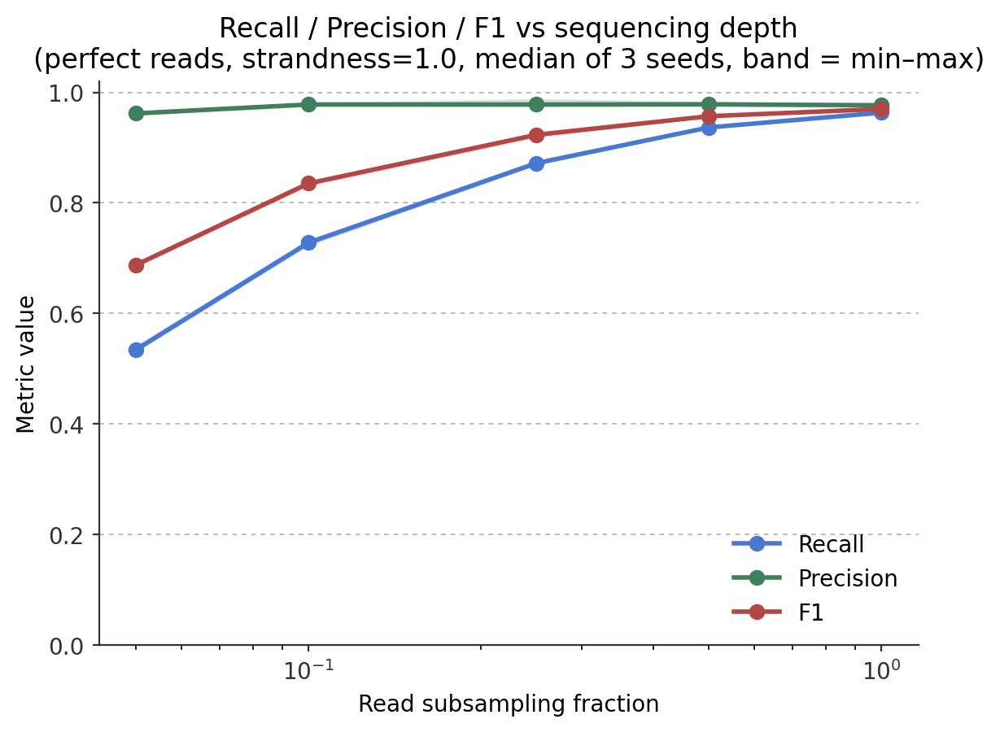

**Interpretation:** Precision is essentially flat (96–98%) across the
*entire* depth range tested, from 5% to 100% — it is not what limits
detection here. Recall is what's depth-limited, and climbs steeply and
monotonically with depth: 53% at 5% depth, 73% at 10%, 87% at 25%, 94% at
50%, 96% at full depth. In other words, missing a real pair is almost
always a sensitivity problem (not enough read support to reconstruct an
isoform), not a specificity problem (the pipeline calling something
spurious).

#### What limits recall

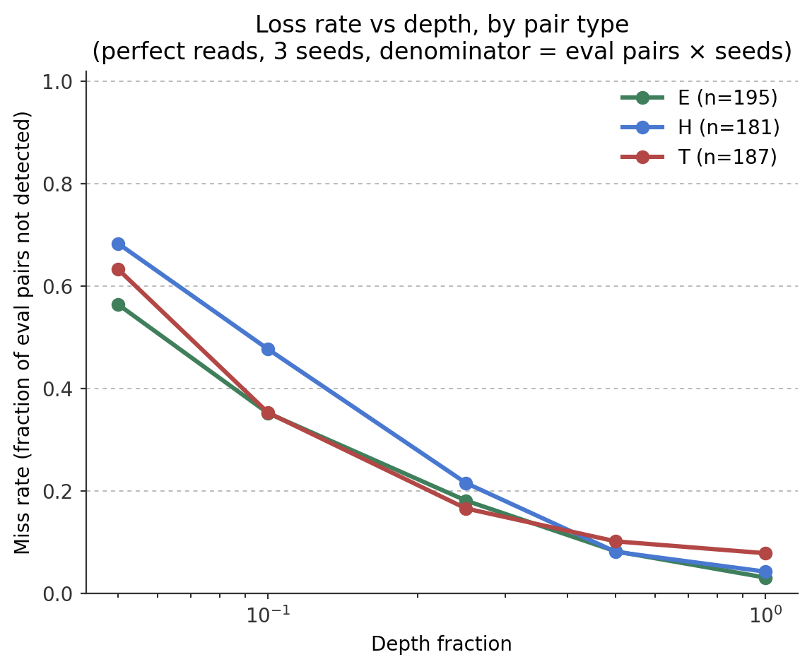

The dominant loss mechanism is FLAIR's failure to reconstruct the
extended end of a transcript during assembly — not an inherent geometric
limitation of any particular overlap type. This was confirmed by manual
inspection of individual lost pairs, including counter-examples that
persist at sequencing depths well above what should be sufficient.
Tail-to-tail pairs are lost most often among the three geometries at full
depth (7.8% miss rate for T vs. 4.2% for H and 3.1% for E), consistent
with this end-reconstruction failure specifically affecting the 3′ end.

*(No structured record of a "cause of loss" classification exists per
lost pair beyond this depth/pair-type breakdown — the loss-mechanism
finding above is a qualitative one from manual review, not derived from
a percentage-labeled dataset.)*

A systematic sweep of FLAIR and SQANTI3 filter parameters did not find
any single-parameter configuration that improved results consistently
across conditions — the loss mechanism appears rooted in FLAIR's internal
clustering logic, not something reachable from the command-line interface.

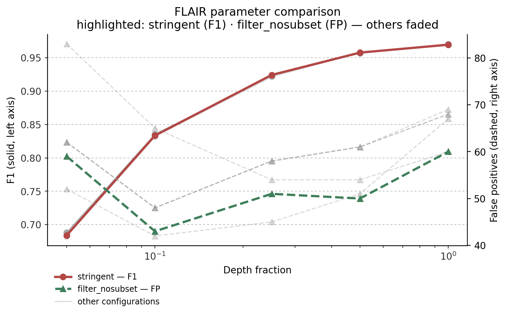
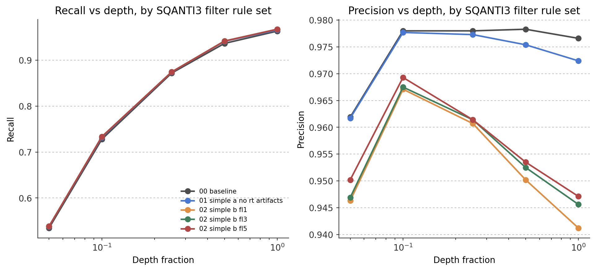

Both sweeps make the same point visually. Six FLAIR configurations were
tested (`baseline`, `stringent`, `check_splice`, `end_window`,
`filter_nosubset`, `max_ends`); the figure above highlights the two most
distinct — `stringent`'s F1 and `filter_nosubset`'s false-positive count —
against the other four, faded, in the background. Both highlighted lines
track the same faded band the other configurations occupy rather than
separating from it. Every tested SQANTI3 filter rule set likewise traces
essentially the same recall curve — the five rule-set lines are
near-indistinguishable from each other at every depth. Recall in
particular is untouched by any of these parameters; the only real
separation is a small amount of precision variance between SQANTI3 rule
sets at low depth, which is not what's failing.

#### False-positive structure (simulated data only)

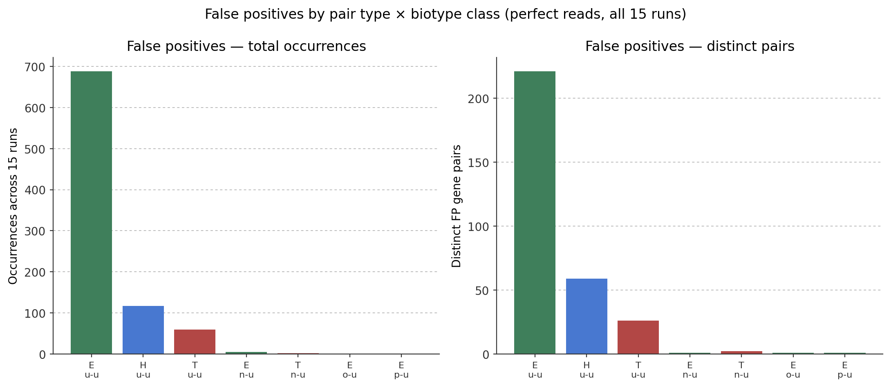

98.4% (306 of 311) of distinct false-positive pairs, across all 15
depth/seed runs, involve two mutually unanchored (novel, not
reference-matched) loci in an embedded configuration — this pattern is
specific to the controlled conditions of simulated data (where a ground
truth exists to call something a false positive at all) and should not
be assumed to carry over to real tissue, where no equivalent ground truth
exists (see next section).

#### Library protocol comparison

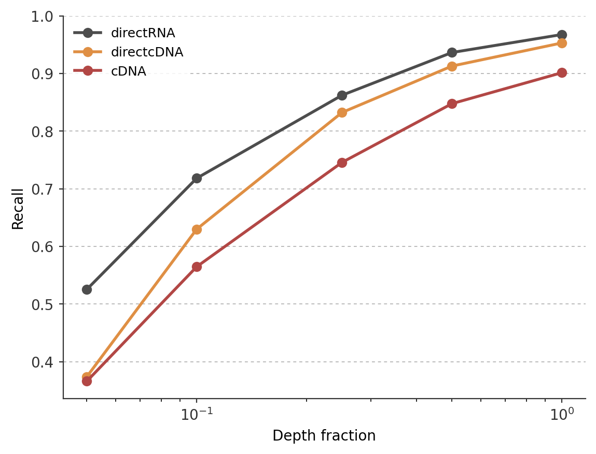
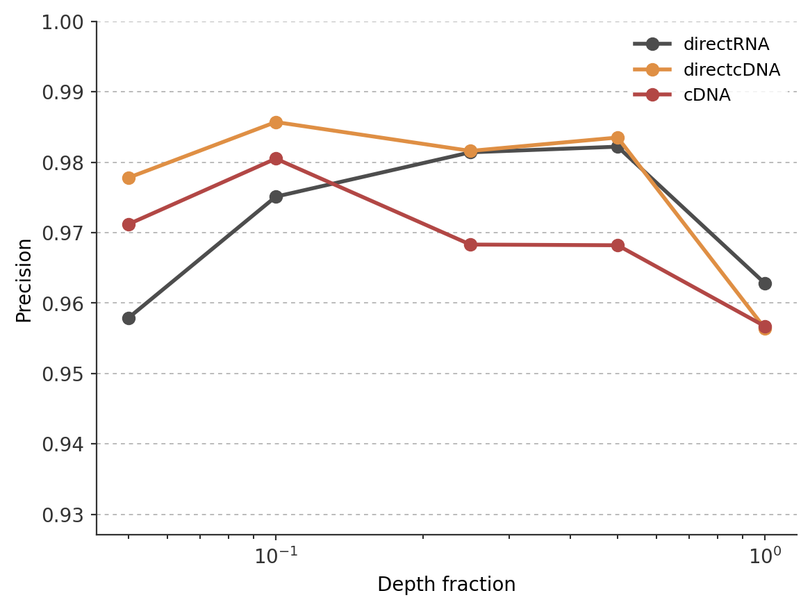

Direct RNA sequencing gives the highest recall among the three protocols
tested. Direct-cDNA — despite its inverted strand orientation relative to
the reference — ranks second, ahead of the PCR-amplified `cDNA` protocol.
This suggests PCR amplification itself degrades detectability more than
the strand-orientation mismatch does. At full depth: directRNA 96.8%
recall / 96.3% precision; direct-cDNA 95.3% / 95.6%; cDNA 90.2% / 95.7%.
Precision itself does not separate the three protocols cleanly at any
depth — the ranking above is a recall effect, not a precision effect.

---

## Benchmarking using real tissue

### Why H9 and HEYA8

Both are [SG-NEx](https://github.com/GoekeLab/sg-nex-data) consortium
samples with matched long-read (ONT) and short-read (Illumina) data and
at least 3 independent biological replicates per protocol — the minimum
needed to assess reproducibility rather than accuracy (see below). H9
(human embryonic stem cells) and HEYA8 (human ovarian cancer) were chosen
deliberately as a contrasting pair — one non-malignant, pluripotent line
and one cancer line — to test whether findings generalize across very
different biological contexts, not just across technical replicates of
the same tissue.

Three protocols were compared: directRNA, direct-cDNA, and cDNA.
cDNAStranded was excluded from this stage due to asymmetric replicate
availability across the two cell lines in the SG-NEx dataset.

### Method — reliability without ground truth

Real tissue expression is unknown in advance, so recall/precision cannot
be computed directly. Instead, three independent, complementary signals
were used to judge reliability:

1. **Cross-replicate reproducibility** — a pair found in all biological
   replicates of a (cell line, protocol) forms its *reliable core*; a
   pair found in only one is *noise*; found in some-but-not-all is
   *partial*.
2. **Reference anchoring** — whether both genes in a pair are
   annotated (`ENSG...`) or unattributed loci invented by the caller for
   unmatched clusters.
3. **Gene-type composition** — what kind of genes (protein-coding /
   noncoding / pseudogene / unanchored) make up the reliable core, joined
   directly against the reference GENCODE annotation (not the caller's
   own `biotype_pair_class`, which is unreliable on real data — see note
   below).

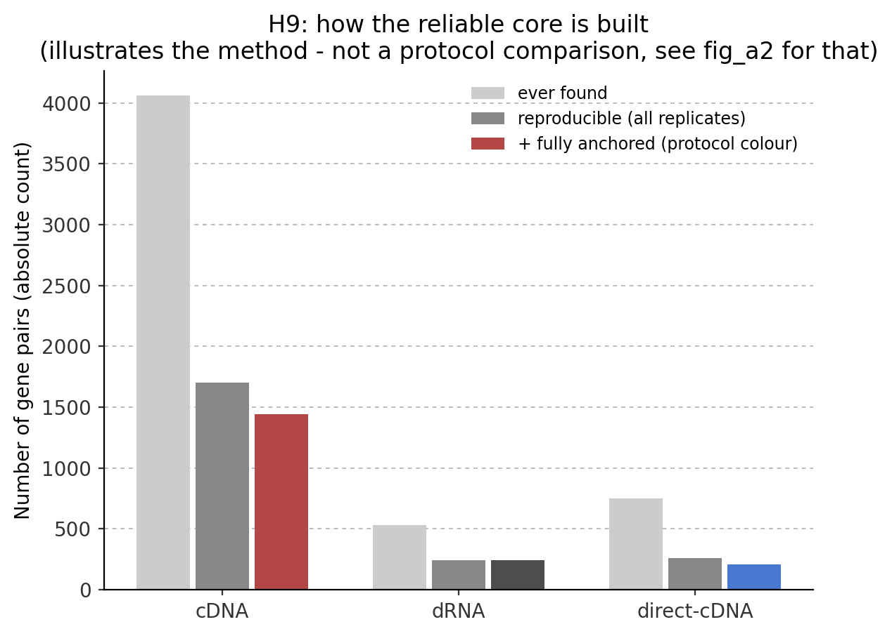
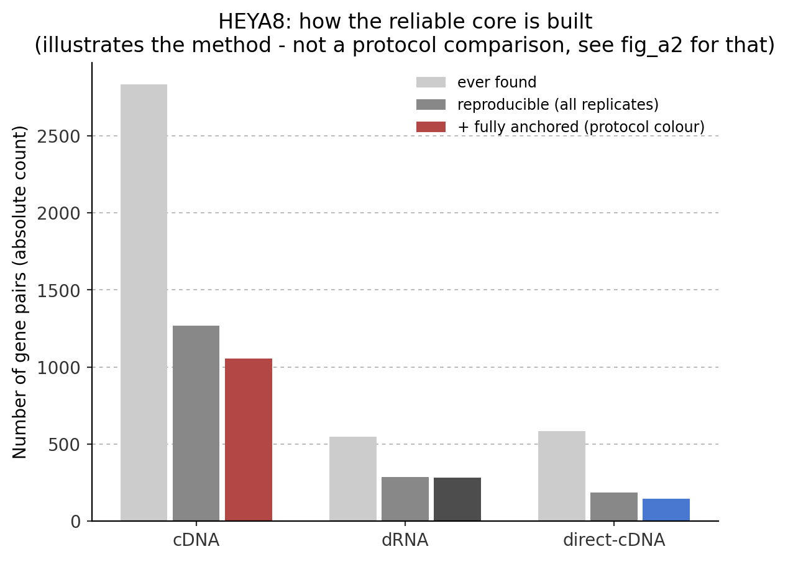

The funnel above illustrates step 1 for cDNA/dRNA/direct-cDNA in each
cell line: most pairs the pipeline *ever* reports in at least one
replicate ("ever found") don't reproduce across all replicates — the
"reliable core" is a small, strict subset. cDNA reports by far the most
pairs ever found (4,061 in H9 / 2,835 in HEYA8) but keeps a similarly
modest fraction as its reliable core (1,702 / 1,268) as the other two
protocols — this is a reproducibility filter, not a protocol
comparison (see the anchoring-rate figure below for that).

> **Known pipeline limitation, found during this stage:** `nat_caller`'s
> own `tx*_biotype_class`/`biotype_pair_class` columns are almost always
> `u` (unknown) on real-tissue output, because the FLAIR/SQANTI3-rescued
> GTF it reads doesn't carry `gene_type` attributes at all — not a
> real-data artifact of the genes themselves, just a missing attribute
> in an intermediate file. Worked around here by joining gene IDs
> directly against the reference GTF instead.

### Results

#### Reliable-core anchoring rate, by protocol

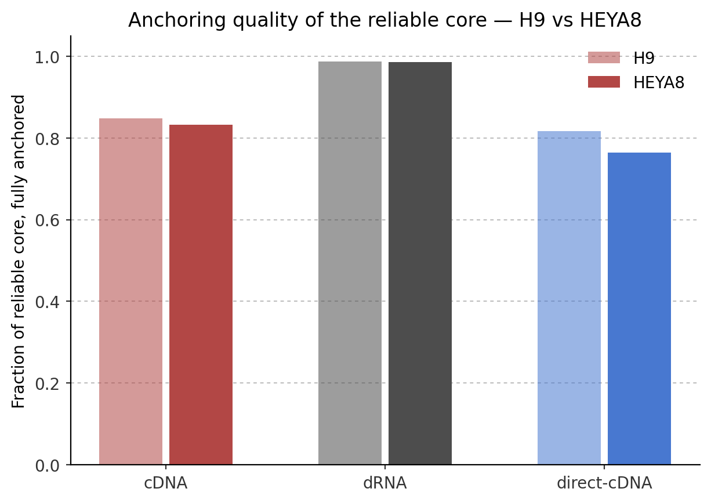

Direct RNA sequencing gives by far the highest fraction of fully-anchored
pairs in its reliable core: 98.8% (H9) / 98.6% (HEYA8). The two
PCR-based protocols trail well behind and separate from each other more
than dRNA's two values do: cDNA 84.7% (H9) / 83.3% (HEYA8), direct-cDNA
81.7% (H9) / 76.5% (HEYA8). The pattern (dRNA ≫ cDNA > direct-cDNA) held
independently in both cell lines, though the exact PCR-protocol gap is
wider than a first glance at H9 alone would suggest — HEYA8's
direct-cDNA in particular drops to 76.5%.

#### Gene-type composition of the reliable core

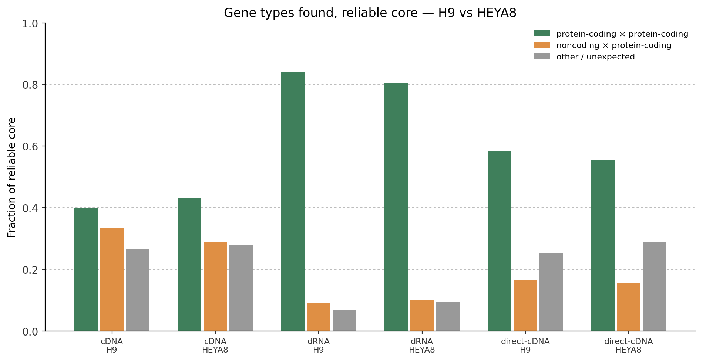

Direct RNA's reliable core is overwhelmingly protein-coding × protein-coding
pairs (84.0% H9 / 80.4% HEYA8), with noncoding×protein-coding a distant
second (9.0% / 10.1%). The two PCR-based protocols show a markedly
different, more mixed composition: cDNA is only 40.0% (H9) / 43.2%
(HEYA8) protein-coding×protein-coding, with noncoding×protein-coding
close behind at 33.4% / 28.9%; direct-cDNA sits in between (58.4% / 55.6%
protein-coding×protein-coding).

The same breakdown in absolute pair counts, rather than fractions —
useful since the reliable cores are very different sizes across
protocols (cDNA's is roughly 5–7× dRNA's or direct-cDNA's; see the
detection-funnel figures above), so a fraction alone can understate how
much more noncoding×protein-coding and other/unexpected signal cDNA
actually carries in raw numbers:

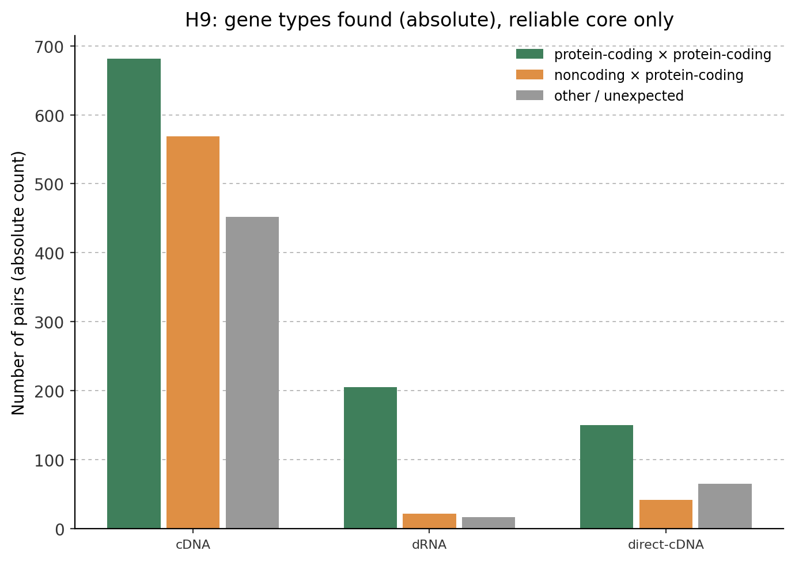
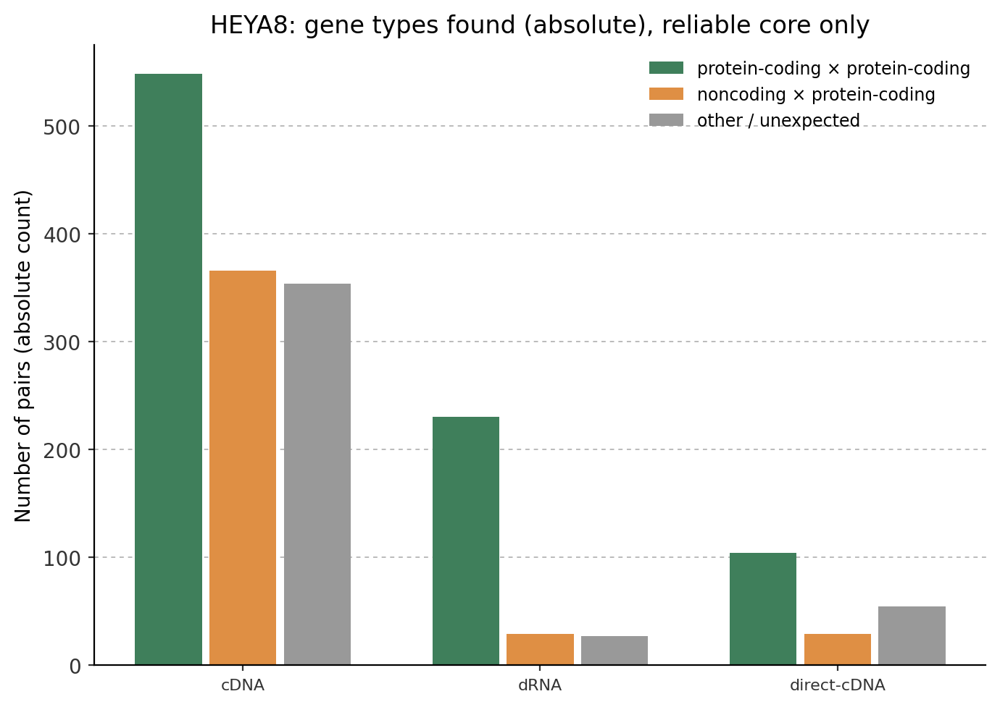

#### Shared vs. tissue-specific pairs

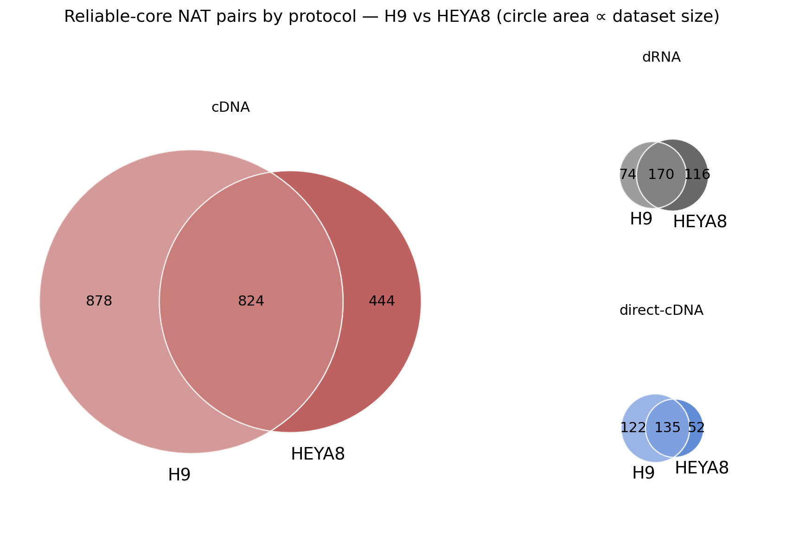

At the reliable-core level: cDNA has 824 pairs shared between H9 and
HEYA8, alongside 878 H9-only and 444 HEYA8-only pairs (Jaccard 0.384);
dRNA has 170 shared, 74 H9-only, 116 HEYA8-only (Jaccard 0.472);
direct-cDNA has 135 shared, 122 H9-only, 52 HEYA8-only (Jaccard 0.437).
A substantial fraction of reliably-detected pairs are shared between the
two cell lines in every protocol, alongside pairs unique to one or the
other — consistent with at least part of NAT regulation being
tissue-independent while another part differs by cell type. Note: pairs
involving an unanchored locus are undercounted as "shared" here, since
the same real novel locus can receive a slightly different
coordinate-derived ID between independent runs — exact matching treats
these as non-identical even when they may represent the same underlying
locus.

#### Note: overlap-type distribution differs from the curated catalogue

The curated reference catalogue (see above) has a near-even split across
H/T/E (181/187/195 in the evaluation set alone). In the real-tissue
reliable core, tail-to-tail pairs dominate for directRNA — 69.7% (H9) /
67.8% (HEYA8) — a sharp contrast worth noting, but treated here as a
preliminary observation rather than a confirmed finding: the curated
catalogue was never designed to be a representative sample of genome-wide
overlap-type frequency, and with a single seed/no independent replication
of this specific comparison, a coincidental skew in this particular pair
of cell lines can't yet be ruled out.

---

## Limitations

- No experimental (RT-PCR, knockdown) validation of any specific
  detected pair has been performed — both benchmark stages are
  computational.
- The real-tissue reliability signals (reproducibility, anchoring,
  composition) are indirect proxies for accuracy, not accuracy itself —
  there is no way to compute true recall/precision without ground truth.
- Simulated read error profiles approximate but don't perfectly replicate
  real Nanopore error characteristics.
